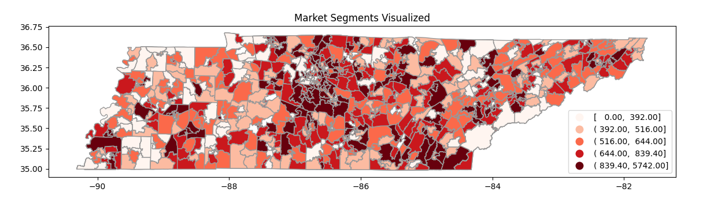
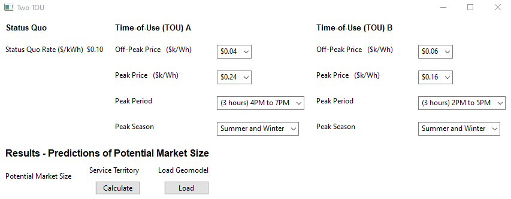
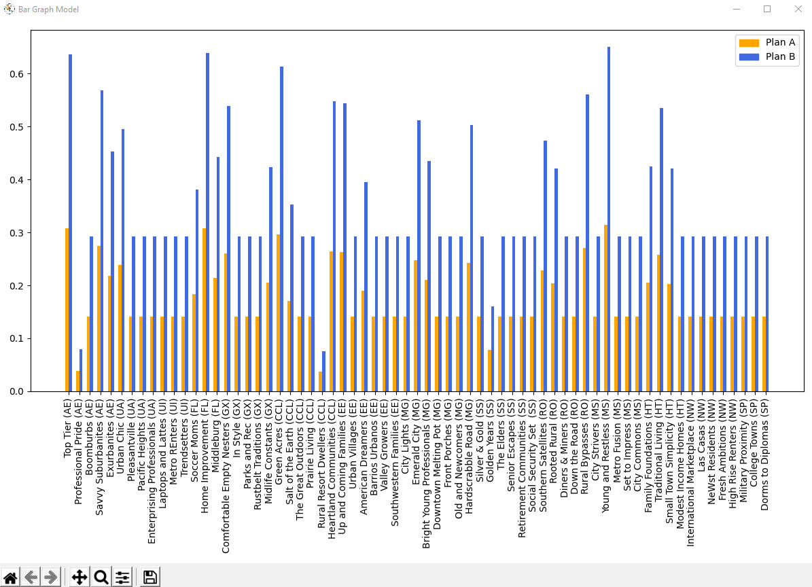

# VeritasEconomicsCM
Despite the substantial potential for residential demand response through Time of Use (TOU) rates TOU offerings are limited.
When utilities do offer TOU rates, uptake can range from almost zero to over 40 percent.
Residential demand response is challenging because it requires enrolling many households to be
effective. Veritas overcomes this challenge by combining advanced customer contact and survey
research techniques with sophisticated econometric and simulation modeling to estimate load
change potential by market segment, hour, census block, and appliance. We use this information to
develop market strategies that induce adoption of time-based rates that are cost-effective and
achieve utility objectives.


## Installation

### Python
Download the latest version of Python from https://www.python.org/downloads/

### Project Dependencies
Most of the dependencies needed for development can be installed using the package manager [pip](https://pip.pypa.io/en/stable/).
```bash
pip install requirements.txt
```
However, remaining packages (Cartopy, Fiona, GDAL, Geopandas, Rasterio) of this time have unreliable installation through pip. If these packages
cannot be installed via pip like this:
```bash
pip install Cartopy
```
Then download the .whl files for the dependencies [here](https://www.lfd.uci.edu/~gohlke/pythonlibs/#gdal).

## Usage
Inputs page:


Graph output page:

