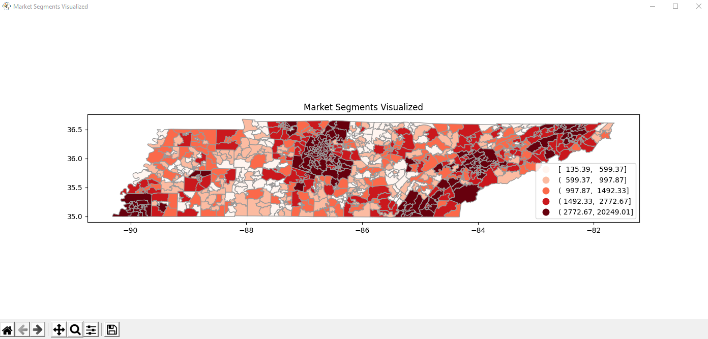

# choice-model-wxpython
A desktop application built using WxPython for electricity service plan optimization using a discrete choice model.


## Installation

### Python
Download the latest version of Python from https://www.python.org/downloads/

### Project Dependencies
Most of the dependencies needed for development can be installed using the package manager [pip](https://pip.pypa.io/en/stable/).
```bash
pip install requirements.txt
```
However, remaining packages (Cartopy, Fiona, GDAL, Geopandas, Rasterio) of this time have unreliable installation through pip. If these packages
cannot be installed via pip like this:
```bash
pip install Cartopy
```
Then download the .whl files for the dependencies [here](https://www.lfd.uci.edu/~gohlke/pythonlibs/#gdal).

## Usage
Inputs page:


Graph output page:

